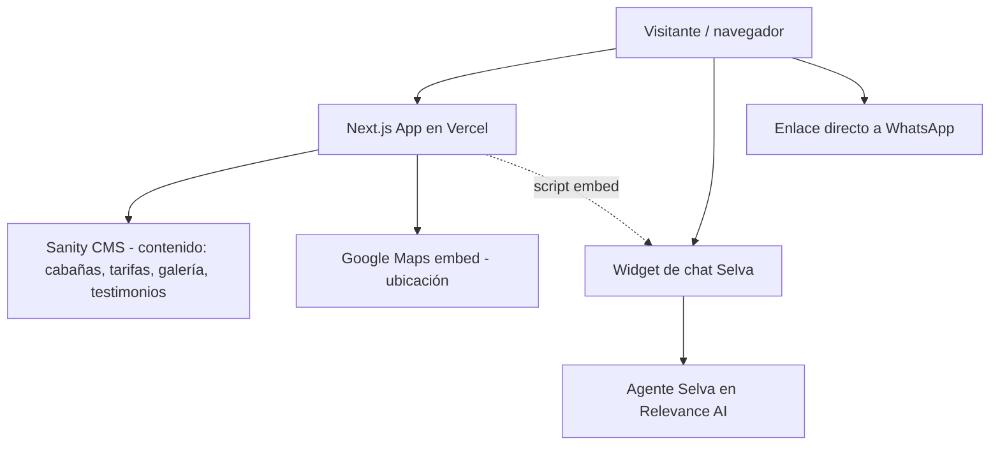

# Arquitectura técnica

<!-- Documento vivo. Actualizar cada vez que cambie el stack, la estructura de carpetas
     o cualquier decisión técnica relevante.
     Los cambios deben registrarse también en changelog/. -->

---

## Stack seleccionado

| Capa | Tecnología | Justificación |
|------|-----------|---------------|
| Framework | **Next.js 14 (App Router)** | Server Components para carga rápida en mobile, buen SEO out-of-the-box (clave para posicionar "hotel boutique Sayulita"), soporte nativo de rutas por idioma (es/en). |
| CMS | **Sanity.io** | CMS headless con un Studio visual (sin código) donde el propietario puede editar cabañas, tarifas por temporada, galería y testimonios. Plan gratuito cubre holgadamente el volumen de contenido de este sitio. |
| Base de datos | No aplica (motor propio) | Todo el contenido editable vive en Sanity; no hay datos transaccionales (no hay pagos ni cuentas de usuario en el sitio). |
| Autenticación | No aplica en el sitio público | El único acceso protegido es el Studio de Sanity (login propio de Sanity), no hay login de usuarios finales. |
| Estilos | **Tailwind CSS** | Permite implementar rápido los tokens de `docs/design-system.md` (paleta, tipografías Athelas/Mouse Deco) como theme de Tailwind, manteniendo consistencia. |
| Despliegue | **Vercel** | Zero-config para Next.js, previews automáticos por rama/PR, fácil de conectar al dominio existente `casaselvasayulita.com` vía cambio de DNS. |
| Internacionalización | **next-intl** (rutas `/es` y `/en`) | Contenido bilingüe requerido en el PRD, con detección de idioma del navegador y selector manual. |

---

## Diagrama de componentes



---

## Estructura de carpetas

```
src/
├── app/
│   ├── [locale]/           → Rutas por idioma (es/en) vía next-intl
│   │   ├── page.tsx         → Home
│   │   ├── habitaciones/    → Listado y detalle de las 5 cabañas
│   │   ├── amenidades/
│   │   ├── galeria/
│   │   ├── nosotros/
│   │   ├── contacto/
│   │   └── testimonios/
│   └── api/                 → Route handlers (si se necesitan, ej. formulario de contacto)
├── components/
│   ├── ui/                  → Componentes base (botones, cards, badges) según design-system.md
│   ├── cabanas/              → Tarjeta de cabaña, galería de cabaña
│   └── chat/                 → Wrapper del widget de Selva (Relevance AI)
├── lib/
│   ├── sanity/               → Cliente Sanity, queries GROQ
│   └── utils/
├── styles/                   → Theme de Tailwind con tokens de design-system.md
└── types/                    → Tipos TypeScript (Cabaña, Tarifa, Testimonio, etc.)

sanity/
└── schemas/                  → Definición de tipos de contenido (cabaña, tarifa, foto, testimonio)
```

---

## Estrategia de autenticación

No aplica al sitio público (sin cuentas de usuario ni áreas protegidas para huéspedes). El único login existente es el del Sanity Studio (`/studio` o subdominio dedicado), gestionado por Sanity con su propio sistema de invitaciones — se invitará al propietario con permisos de edición de contenido.

---

## Integraciones externas

- **Relevance AI (agente "Selva"):** widget de chat embebido mediante script tag en el layout raíz de Next.js, visible en todas las páginas. La lógica del agente vive en Relevance AI (fuera de este repo); aquí solo se integra el embed.
- **Sanity.io:** CMS de contenido — cabañas, tarifas por temporada, fotos de galería, testimonios. Se consulta en build time (SSG) y se puede revalidar on-demand cuando el propietario publique cambios.
- **Google Maps:** embed en la página de Contacto/Ubicación para mostrar Calle Chachalacas 45, Sayulita.
- **WhatsApp:** enlace directo `https://wa.me/523222441794` visible en header/footer y como fallback si el chat no está disponible.
- **Instagram / Facebook:** enlaces a @casaselva.sayulita y facebook.com/casaselvasayulita.

---

## Estrategia de despliegue

**Fase actual — prototipo, sin tocar el sitio en vivo:** por instrucción explícita del propietario, este proyecto se queda en fase de prototipo para revisión. No se toca el dominio `www.casaselvasayulita.com` ni su DNS, y no se hace ningún despliegue a producción. El propietario será quien decida cuándo y cómo publicarlo.

- **Repositorio:** este mismo repo (`guillermoricardo/opt-sfr`), rama de trabajo actual.
- **Cómo se revisa el prototipo:** se ejecuta localmente (`npm run dev`) y/o se despliega a una URL de preview desacoplada del dominio real (por ejemplo un preview de Vercel en un subdominio tipo `*.vercel.app`), solo para que el propietario lo revise visualmente. Ningún preview se conecta al dominio ni al hosting actual del sitio real.
- **Migración de dominio/DNS:** explícitamente fuera de alcance por ahora. Se documentará el procedimiento cuando el propietario decida avanzar con el lanzamiento.
- **Variables de entorno:** claves de Sanity (project ID, dataset, token de lectura) y el script/ID del widget de Relevance AI — se configuran solo en el entorno de preview, nunca en el sitio real.

---

## Decisiones técnicas relevantes

### 2026-07-16 — Migrar de Squarespace/Wix a stack a medida (Next.js + Sanity + Vercel)
**Contexto:** el sitio actual corre en un builder tipo Squarespace/Wix. El propietario quiere un rediseño moderno, funcional, con mejor rendimiento y control total sobre dónde y cómo se embebe el widget del agente de reservas.
**Opciones consideradas:** (1) rediseñar dentro del builder actual editando bloques/CSS personalizado; (2) migrar a un stack a medida con código.
**Decisión:** migrar a un stack a medida (Next.js + Sanity + Vercel), decisión explícita del propietario, priorizando calidad y control sobre velocidad de lanzamiento.
**Consecuencias:** requiere migrar DNS del dominio existente y requiere un CMS (Sanity) para que el propietario, sin conocimientos de programación, pueda seguir editando contenido (fotos, tarifas, texto) sin depender de un desarrollador para cada cambio.
