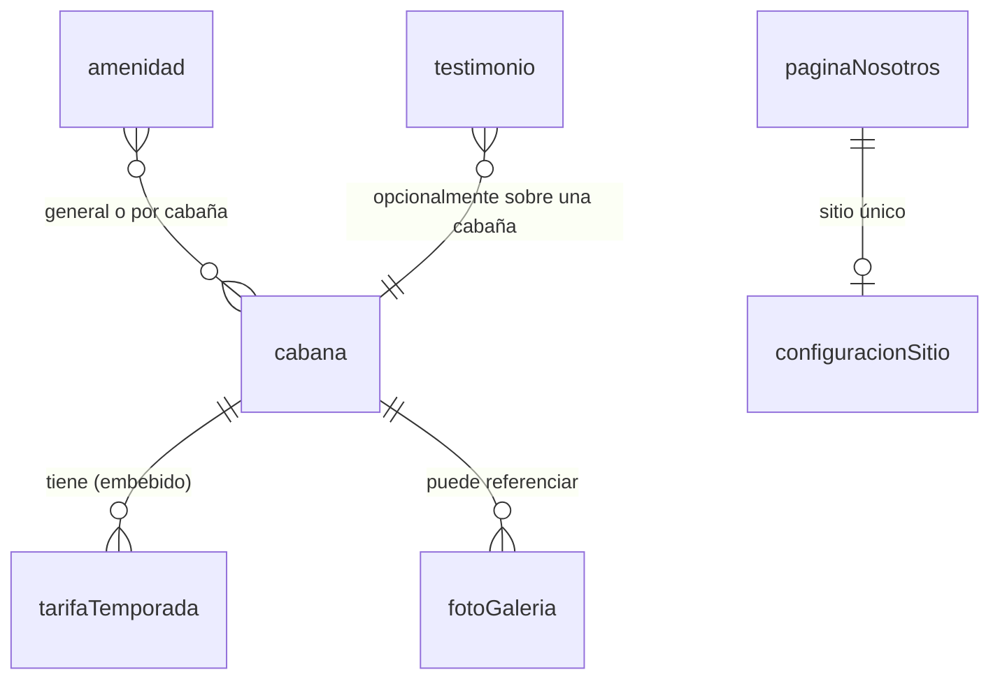

# Modelo de datos

<!-- Actualizar este archivo cada vez que se añada, modifique o elimine un tipo de contenido.
     El agente de codificación debe consultar este archivo antes de tocar los schemas de Sanity.

     Nota: este proyecto no usa una base de datos relacional (no hay Supabase/SQL).
     El contenido vive como documentos en Sanity CMS (headless, sin esquema SQL ni RLS),
     así que las secciones de este archivo están adaptadas a ese modelo. -->

---

## Entidades principales

<!-- Cada entidad es un "document type" del schema de Sanity (sanity/schemas/). -->

### cabana
Cada una de las 5 cabañas de Casa Selva.
| Campo | Tipo | Descripción |
|-------|------|-------------|
| nombre | string | Ej. "Canopy Cabin", "Jungle Nest", "Treehouse", "Casa Selva", "Jungle Heart" |
| slug | slug | Para la URL de detalle (`/habitaciones/[slug]`) |
| capacidad | number | Personas máximas (2 en todas, 3 en Treehouse) |
| superficie | string | Ej. "~40 m²" |
| distribucion | array\<text\> (i18n es/en) | Descripción de ambientes (recámara, sala, cocineta, terraza, etc.) |
| vista | string (i18n es/en) | Ej. "Jardines de la propiedad" |
| destacado | text (i18n es/en) | Texto de venta / lo que la distingue |
| fotos | array\<image\> | Galería propia de la cabaña |
| tarifas | array\<objeto tarifaTemporada\> | Ver abajo |
| orden | number | Controla el orden de despliegue en el listado |

### tarifaTemporada (objeto embebido dentro de `cabana`, no documento propio)
| Campo | Tipo | Descripción |
|-------|------|-------------|
| temporada | string (enum: baja / media / alta) | baja = jun-sep, media = may/oct/nov, alta = dic-abr |
| precioMXN | number | Precio por noche en pesos mexicanos, incluye desayuno para 2 |

### amenidad
| Campo | Tipo | Descripción |
|-------|------|-------------|
| nombre | string (i18n es/en) | Ej. "Piscina", "WiFi de alta velocidad" |
| descripcion | text (i18n es/en) | Detalle/condiciones (ej. horario de piscina) |
| icono | string o image | Referencia a ícono a usar |
| categoria | string (enum: propiedad / cabaña) | Distingue amenidades generales de la propiedad vs. incluidas en cada cabaña |

### fotoGaleria
| Campo | Tipo | Descripción |
|-------|------|-------------|
| imagen | image | Archivo de foto |
| alt | string (i18n es/en) | Texto alternativo |
| categoria | string | Ej. selva, alberca, cabaña, detalle — para poder alternar tomas de detalle y tomas más ocupadas según el criterio del brand book |
| orden | number | Orden de despliegue en la galería |

### testimonio
| Campo | Tipo | Descripción |
|-------|------|-------------|
| nombreHuesped | string | Nombre del huésped |
| origen | string (opcional) | País/ciudad de origen |
| texto | text (i18n es/en) | Reseña |
| fecha | date | Fecha de la estancia/reseña |

### paginaNosotros (documento singleton)
| Campo | Tipo | Descripción |
|-------|------|-------------|
| titulo | string (i18n es/en) | |
| contenido | rich text (i18n es/en) | Historia de Casa Selva, filosofía, propietarios |
| fotos | array\<image\> | |

### configuracionSitio (documento singleton)
| Campo | Tipo | Descripción |
|-------|------|-------------|
| direccion | string | Calle Chachalacas 45, Sayulita, Nayarit, C.P. 63734 |
| coordenadasMapa | geopoint | Para el embed de Google Maps |
| whatsapp | string | +52 322 244 1794 |
| email | string | info@casaselvasayulita.com |
| instagram | url | https://www.instagram.com/casaselva.sayulita/ |
| facebook | url | https://facebook.com/casaselvasayulita |
| checkIn / checkOut | string | 3:00 PM / 1:00 PM |
| politicas | text (i18n es/en) | Mascotas, fumadores, estancia mínima, etc. — debe mantenerse alineado con `assets/agent/Antecedentes_CSS.md` |

### blogPost (COULD — solo si se activa la sección de blog)
| Campo | Tipo | Descripción |
|-------|------|-------------|
| titulo | string (i18n es/en) | |
| slug | slug | |
| contenido | rich text (i18n es/en) | |
| imagenDestacada | image | |
| fecha | datetime | |

---

## Relaciones entre entidades

---

## Modelo de acceso (Sanity Studio)

<!-- No hay RLS porque no hay base de datos relacional. El control de acceso es el propio
     de Sanity: quién puede entrar al Studio y editar contenido. -->
- El propietario (Guillermo) se invita al proyecto de Sanity con rol **Editor**: puede crear/editar/publicar cabañas, tarifas, fotos, testimonios y la configuración del sitio, sin tocar código.
- El contenido publicado en Sanity es de solo lectura pública a través de la API que consume el sitio (no hay escritura desde el frontend).
- No hay cuentas de usuario final ni datos privados de huéspedes almacenados en este sistema (los datos de contacto que captura el agente Selva viven en Relevance AI, no en este CMS).

---

## Migraciones

<!-- En Sanity no hay migraciones SQL; se registra aquí cada cambio de schema relevante. -->
| Fecha | Cambio | Descripción |
|-------|--------|-------------|
| — | — | Aún no se ha creado el proyecto de Sanity ni los schemas (pendiente de fase de implementación) |

---

## Datos seed

Al crear el proyecto de Sanity, se debe poblar con el contenido ya existente en `assets/agent/Antecedentes_CSS.md`:
- Las 5 cabañas (Canopy Cabin, Jungle Nest, Treehouse, Casa Selva, Jungle Heart) con sus tarifas de temporada baja/media/alta.
- Las amenidades generales de la propiedad y las incluidas en todas las cabañas.
- Los datos de `configuracionSitio` (dirección, WhatsApp, email, redes sociales, check-in/check-out, políticas).
- Fotos: pendientes de que el propietario las suba a `assets/photos/`.
- Testimonios: pendientes, no hay ninguno provisto todavía.
