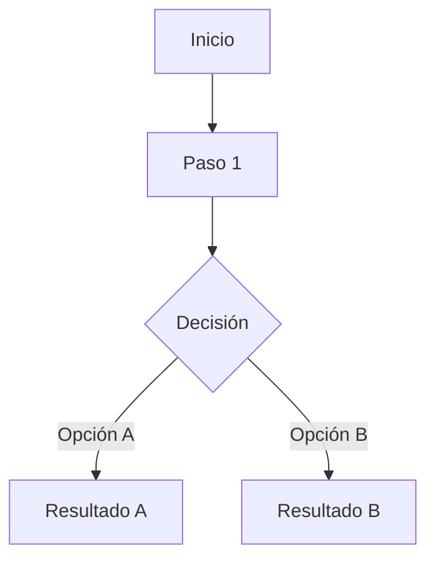

# Flujos de usuario

<!-- Documentación detallada de los flujos de usuario principales.
     El PRD los describe narrativamente; este archivo entra en detalle con diagramas y estados.
     Actualizar cuando cambie un flujo existente o se añada uno nuevo. -->

---

## Convenciones de este documento

<!-- Los flujos se documentan con:
     1. Descripción narrativa (qué hace el usuario, qué ve)
     2. Diagrama de flujo en Mermaid (estados y transiciones)
     3. Estados de error y casos edge
     
     Cada flujo tiene un ID para poder referenciarlo desde el PRD o desde el código. -->

---

## [FLOW-01] — Nombre del flujo

<!-- Ejemplo: Registro y onboarding -->

**Actor:** <!-- Quién ejecuta el flujo -->
**Trigger:** <!-- Qué lo inicia -->
**Resultado esperado:** <!-- Qué ha conseguido el usuario al terminar -->

### Pasos

<!-- Descripción paso a paso desde la perspectiva del usuario. -->

1. <!-- ... -->

### Diagrama

### Casos de error

<!-- Qué pasa si algo sale mal en cada paso. Cómo se comunica al usuario. -->

---

<!-- Duplica la sección anterior para cada flujo adicional -->
