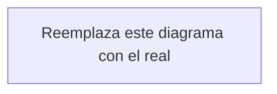

# Arquitectura técnica

<!-- Documento vivo. Actualizar cada vez que cambie el stack, la estructura de carpetas
     o cualquier decisión técnica relevante.
     Los cambios deben registrarse también en changelog/. -->

---

## Stack seleccionado

<!-- Lista el stack con justificación breve de cada decisión.
     Ejemplo:
     - **Next.js 14 (App Router):** Server Components para reducir bundle, mejor SEO.
     - **Supabase:** Base de datos + Auth + Storage en un solo servicio, bien integrado con Next.js.
     - **Tailwind CSS + shadcn/ui:** Velocidad de desarrollo sin sacrificar personalización.
     - **Vercel:** Despliegue zero-config para Next.js, previews por rama. -->

| Capa | Tecnología | Justificación |
|------|-----------|---------------|
| Framework | <!-- --> | <!-- --> |
| Base de datos | <!-- --> | <!-- --> |
| Autenticación | <!-- --> | <!-- --> |
| Estilos | <!-- --> | <!-- --> |
| Despliegue | <!-- --> | <!-- --> |

---

## Diagrama de componentes

<!-- Diagrama en Mermaid que muestre cómo interactúan los componentes principales.
     Ejemplo:
     ```mermaid
     graph TD
       Client[Navegador] --> NextJS[Next.js App]
       NextJS --> Supabase[Supabase API]
       Supabase --> DB[(PostgreSQL)]
       Supabase --> Storage[Storage]
       NextJS --> Resend[Resend API]
     ```
-->



---

## Estructura de carpetas

<!-- Documenta la estructura real del proyecto con una línea de descripción por carpeta.
     Ejemplo:
     ```
     src/
     ├── app/              → Rutas (App Router de Next.js)
     │   ├── (auth)/       → Rutas protegidas por autenticación
     │   └── api/          → Route handlers
     ├── components/
     │   ├── ui/           → Componentes base (shadcn/ui)
     │   └── [feature]/    → Componentes específicos de cada feature
     ├── lib/
     │   ├── supabase/     → Cliente Supabase y helpers
     │   └── utils/        → Funciones utilitarias
     ├── hooks/            → Custom hooks de React
     └── types/            → Tipos TypeScript compartidos
     ``` -->

---

## Estrategia de autenticación

<!-- Explica cómo funciona la autenticación.
     Qué proveedor, qué flujo (magic link, OAuth, password), cómo se gestiona la sesión,
     cómo se protegen las rutas. -->

---

## Integraciones externas

<!-- Lista de servicios de terceros con descripción de para qué se usan y cómo se integran.
     Ejemplo:
     - **Resend:** Envío de emails transaccionales. Se llama desde server actions.
     - **Stripe:** Pagos. Webhooks procesados en /api/webhooks/stripe. -->

---

## Estrategia de despliegue

<!-- Describe el flujo desde desarrollo hasta producción.
     Ramas, entornos (local / staging / producción), CI/CD si existe, variables de entorno por entorno. -->

---

## Decisiones técnicas relevantes

<!-- Registro de decisiones arquitectónicas importantes con su razonamiento.
     Útil para no repetir debates ya resueltos.
     Formato sugerido:
     
     ### [Fecha] — [Título de la decisión]
     **Contexto:** por qué surgió la decisión
     **Opciones consideradas:** qué alternativas se evaluaron
     **Decisión:** qué se eligió
     **Consecuencias:** qué implica a futuro -->
