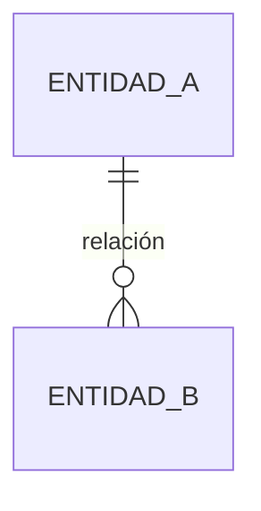

# Modelo de datos

<!-- Actualizar este archivo cada vez que se añada, modifique o elimine una tabla o relación.
     El agente de codificación debe consultar este archivo antes de hacer cualquier migración. -->

---

## Entidades principales

<!-- Por cada tabla, describe: nombre, propósito, campos con tipo y restricciones.
     Ejemplo:
     
     ### users (gestionada por Supabase Auth)
     Tabla nativa de Supabase. No se modifica directamente.
     
     ### profiles
     Extensión de `users` con datos de la aplicación.
     | Campo | Tipo | Descripción |
     |-------|------|-------------|
     | id | uuid (FK → auth.users) | Identificador del usuario |
     | username | text (único) | Nombre de usuario público |
     | avatar_url | text | URL del avatar en Storage |
     | created_at | timestamptz | Fecha de creación |
-->

---

## Relaciones entre entidades

<!-- Diagrama en Mermaid con las relaciones entre tablas.
     Ejemplo:
     ```mermaid
     erDiagram
       profiles ||--o{ collections : "tiene"
       collections ||--o{ items : "contiene"
     ```
-->



---

## Políticas de acceso (RLS)

<!-- Si usas Supabase, documenta aquí las Row Level Security policies activas.
     Por tabla: qué operaciones están permitidas y bajo qué condiciones.
     Ejemplo:
     
     ### profiles
     - SELECT: cualquier usuario autenticado puede leer cualquier perfil
     - UPDATE: solo el propio usuario puede actualizar su perfil
     - DELETE: deshabilitado -->

---

## Migraciones

<!-- Registro de las migraciones aplicadas en orden cronológico.
     Ejemplo:
     | Fecha | Archivo | Descripción |
     |-------|---------|-------------|
     | 2024-01-15 | 001_initial_schema.sql | Creación de tablas iniciales |
     | 2024-01-22 | 002_add_avatar.sql | Campo avatar_url en profiles | -->

| Fecha | Archivo | Descripción |
|-------|---------|-------------|
| <!-- --> | <!-- --> | <!-- --> |

---

## Datos seed

<!-- Si el proyecto necesita datos iniciales para funcionar (categorías, roles, configuración...),
     documenta aquí qué datos se insertan y dónde está el script de seed. -->
